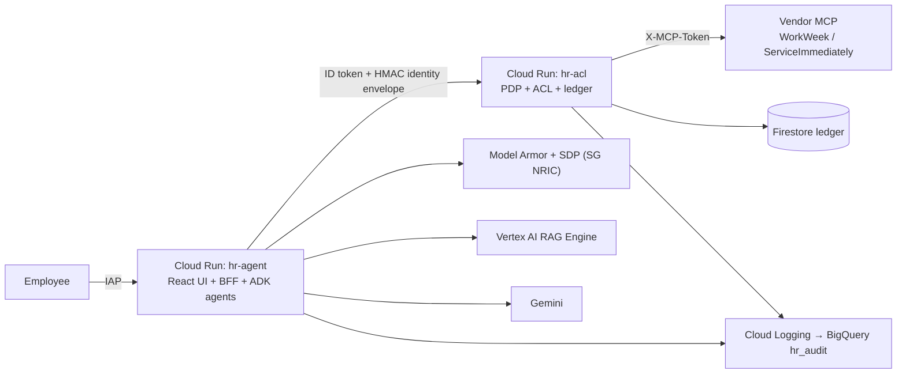

# Altostrat HR Agentic Assistant — MVP 1

Multi-agent HR/IT assistant for Altostrat Singapore, built to the
[Solution Design Document](../docs/sdd.md). Grounded policy Q&A with citations,
WorkWeek (HCM) and ServiceImmediately (ITSM) transactions behind a deterministic
Policy Decision Point, and cross-system orchestration (UC-2.x).



## Project structure

```
hr-agent/
├── app/
│   ├── agent.py              # Root orchestrator + Policy / WorkWeek / ServiceImmediately agents (SDD §3.1)
│   ├── tools.py              # Agent tool surface (the FR-1.1 capability manifest)
│   ├── guardrails/           # ADK plugin: Model Armor + local classifier, SPII redaction, tool allow-list
│   ├── integration/          # ACL, PDP (rules.yaml), ledger (sqlite|Firestore), audit, backend client
│   ├── policy/               # Handbook ingestion (C-1..C-6), retrievers (RAG Engine | BM25), rag_sync
│   ├── ui_bff.py, ui_events.py  # AG-UI SSE BFF for the React UI (SDD §3.10)
│   └── fast_api_app.py       # Serves UI + BFF + ADK API
├── acl_service/              # hr-acl Cloud Run service (Integration Plane, SDD D7/D9)
├── frontend/                 # React + Vite chat UI (citations, confirmation cards, trace)
├── mock_backends/            # Seeded vendor mock — tests/eval/local only, NOT shipped in images
├── deployment/
│   ├── terraform/            # All GCP infrastructure
│   ├── cloudbuild.yaml       # Builds hr-agent + hr-acl images
│   └── deploy.sh             # One-command, idempotent deploy
├── tests/                    # unit, integration, eval (datasets, metrics, gate)
└── scripts/                  # probe_backend.py (read-only vendor probe), package_eval.sh
```

## Local development

Requirements: [uv](https://docs.astral.sh/uv/), Node 20+, gcloud (for live model calls).

```bash
uv sync
cp .env.example .env          # set GOOGLE_CLOUD_PROJECT; BACKEND_MODE=inprocess uses the seeded mock
make ui-install ui-build
make run                      # UI + BFF + agents on http://localhost:8000 (ADK dev UI at /dev-ui/)
make test                     # unit + offline integration, PDP 100% branch gate
make ui-test                  # tsc + vitest
make eval-offline             # retrieval Recall@5/MRR + guardrail detection/FP (no model)
```

Live model answers need `gcloud auth application-default login`. Locally, `RAG_CORPUS`
empty means the deterministic BM25 retriever; set it to exercise Vertex AI RAG Engine.

## Deploy to Google Cloud

Everything is in [`deployment/terraform`](deployment/terraform). All regional resources are
in `asia-southeast1` (SDD CON-5); Gemini uses the `global` endpoint pending SDD OQ-5.

| Resource | Purpose (SDD) |
| :-- | :-- |
| Cloud Run `hr-agent` (native IAP, 1 instance, session affinity) | UI + BFF + agents (§3.10, §4.4) |
| Cloud Run `hr-acl` (IAM: `hr-agent-sa` only) | PDP + ACL + vendor proxy (D7, D9) |
| Firestore `hr-ledger` | Idempotency + saga ledger (§1.3, NFR-4.3) |
| Model Armor `hr-input` / `hr-output` + DLP templates (SG NRIC/FIN) | FR-1.3, FR-1.4, CON-7 |
| Vertex AI RAG Engine corpus + GCS corpus bucket | Grounded retrieval (D3, FR-5.x) |
| Secret Manager | Vendor PAT, identity-envelope + confirm-token HMAC keys (§4.7) |
| BigQuery `hr_audit` + log sink + log metrics | Audit trail, DENY/block indicators (§4.6) |
| Artifact Registry, Cloud Build SA | Images |

```bash
# 1. once
cp deployment/terraform/terraform.tfvars.example deployment/terraform/terraform.tfvars
#    edit: backend_base_url, iap_members, persona_map, demo_employee_id
#    .env must hold BACKEND_SHARED_TOKEN (pushed to Secret Manager, never to tfstate)
gcloud auth login && gcloud auth application-default login

# 2. deploy (bootstrap -> infra -> push-secrets -> rag-sync -> build -> apply -> smoke)
make deploy

# code-only redeploy / individual steps
make redeploy
make rag-sync | make push-secrets | make tf-plan | make smoke
make tf-validate                  # terraform fmt + validate (no cloud access)
```

`rag-sync` uploads one GCS object per governed chunk and imports them into RAG Engine,
so citations still resolve to the ingestion's content-hash anchors (§3.7 C-4).

### Environment binding

| Variable | hr-agent | hr-acl | Source |
| :-- | :-: | :-: | :-- |
| `GOOGLE_CLOUD_PROJECT`, `GOOGLE_CLOUD_LOCATION`, `HR_DEFAULT_MODEL` | ✅ | (project) | tfvars |
| `INTEGRATION_MODE=remote`, `ACL_URL` | ✅ | | hr-acl URI |
| `PERSONA_MAP_JSON`, `DEMO_EMPLOYEE_ID`, `UI_DEV_PERSONAS=0` | ✅ | | tfvars |
| `MODEL_ARMOR_TEMPLATE_ID_INPUT/OUTPUT`, `MODEL_ARMOR_LOCATION` | ✅ | | Terraform |
| `RAG_CORPUS`, `RAG_LOCATION`, `POLICY_CORPUS_BUCKET`, `LOGS_BUCKET_NAME` | ✅ | | rag-sync / Terraform |
| `IDENTITY_ENVELOPE_SECRET`, `CONFIRM_TOKEN_SECRET` | 🔐 | 🔐 | Secret Manager |
| `BACKEND_MODE=mcp`, `BACKEND_BASE_URL` | | ✅ | tfvars |
| `BACKEND_SHARED_TOKEN` / `BACKEND_TOKENS_JSON` | | 🔐 | Secret Manager (from `.env`) |
| `LEDGER_BACKEND=firestore`, `FIRESTORE_DATABASE`, `AUDIT_SINK=stdout` | ✅ | ✅ | fixed |

### Known MVP limitations (by design — SDD §1.2 / §2.2)

- **Shared PAT → one persona** (SDD §5.1): every IAP user acts as `demo_employee_id` unless
  per-persona PATs are enabled (`enable_per_persona_tokens`, `BACKEND_TOKENS_JSON`).
- **In-memory sessions** → `hr-agent` capped at 1 instance (Pilot: shared session service).
- **Cloud Run instead of Agent Runtime** for the agent, and **RAG Engine instead of Vertex AI
  Search** (Search has no Singapore location) — documented deviations from SDD D1/D3.
- Deferred per SDD: VPC-SC (OOS-1), CMEK (OOS-4), Agent Registry/Gateway (OOS-7), multi-region (OOS-5).
